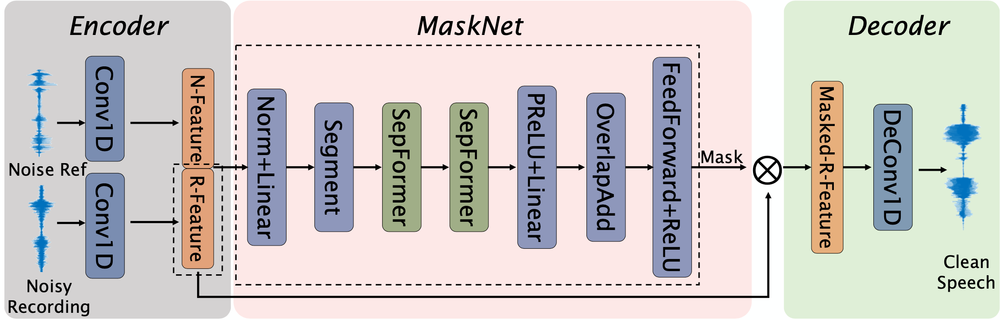

# InfoMix: The content recovery part for paper: Phoneme-Based Proactive Anti-Eavesdropping with Controlled Recording Privilege 
>(Submitted to TDSC, journal version of paper: InfoMasker: Preventing Eavesdropping Using Phoneme-Based Noise (NDSS'23))

This project is built mainly based on **Libri2Mix** in [Speechbrain](https://speechbrain.github.io)

Different from Libri2Mix, InfoMix has two inputs(noisy audio and noise reference) but one output (clean audio), so the input and the output of the MaskNet need to be modified. The modified **Dual_Path_Model** is in utils/new_dual_path.py and induced in the MaskNet part of hparams/sepformer-infomix.yaml. 

## Model overview


## Install packages
1. Install python pacakges
```bash
pip install -r requirements.txt
```
2. Install HTK, refer to [link](https://htk.eng.cam.ac.uk/docs/inst-nix.shtml)

## Data preparation
### Prepare Room Impulse Response (RIR) datasets
1. Here we choose 3 RIR datasets: [Aachen Impulse Response Database v1.4](https://www.iks.rwth-aachen.de/forschung/tools-downloads/databases/aachen-impulse-response-database), [RWCP](https://us.openslr.org/resources/13), and [METU SPARG Eigenmike em32 Acoustic Impulse Response Dataset v0.1.0](https://zenodo.org/records/2635758). When first running the code for training dataset generation, these three RIR datasets will be downloaded and extracted automatically (It needs about 5.6G free disk space). You can also run the prepare_dataset/utils/rir_dataset.py for test and dataset pre_download before generating training dataset. If you need another RIR dataset, just add a class and change the available_dataset parameter in the prepare_dataset/utils/rir_dataset.py.

### Extract phoneme index for a dataset
1. Download and unzip [LibriSpeech](https://www.openslr.org/12) dataset, and set the 'LIBRISPEECH_PATH' parameter in prepare_dataset/utils/parameters.py
2. Download the [Prosodylab-Aligner](https://github.com/prosodylab/Prosodylab-Aligner) and put the files in prepare_dataset/Prosodylab-Aligner, then set the 'ALIGNER_PATH' parameter in preare_dataset/utils/parameters.py. Please following the github pages of Prosodylab-Aligner to **install HTK** before using this aligner. You can also choose other aligners to extract phonemes, just put the vowel.csv and the consonant.csv results at the correct place.
3. Run **prepare_dataset/extract_phoneme.py**. It will create vowel.csv and consonant.csv for each audio file. The csv file contains start timestamp and end timestamp for each phoneme.

### Prepare training dataset
1. Run **prepare_dataset/make_dataset_from_librispeech.py**


## Training InfoMix
1. Set the correct 'data_folder' and 'base_folder_dm' in separation/hparams/sepformer-infomix.yaml
  1. Typically, 'base_folder_dm' = 'data_folder/train_data_8k'
2. Run separation/train.sh
