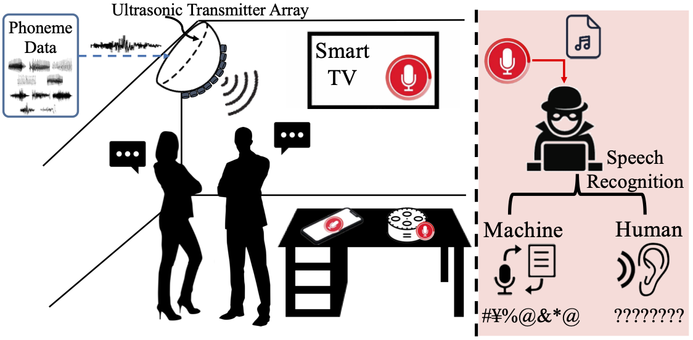

# InfoMasker: Preventing Eavesdropping Using Phoneme-Based Noise

This repo corresponds to the paper "InfoMasker: Preventing Eavesdropping Using Phoneme-Based Noise". Here we provide the method to generate our noise and relevant codes.

We also provide audio samples generated in digital domain and samples recorded in real-world scenarios in this [Demo Page](https://infomasker2023.github.io/) for better demonstration.

Codes in *code* folder are used for noise generation in digital domain.

Codes in *matlab_code* folder are used for noise compensation and modulation for real-world scenarios.
